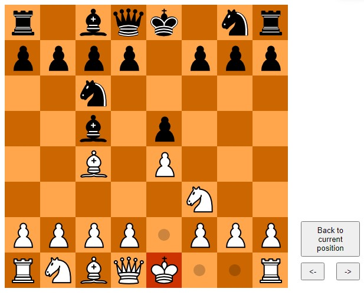

# js-chess
A playable chess board! Using p5.js.

<h2>Feature</h2>
<ul>
<li>Playable: Legal moves generator, black/white's turn, etc</li>
<li>Click and drop movement</li>
<li>Backward, forward, current position button</li>
</ul>

<h2>Screenshot📷</h2>

